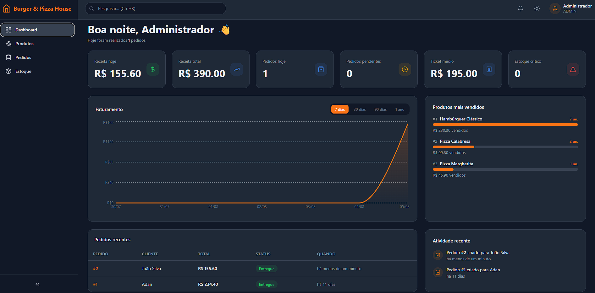
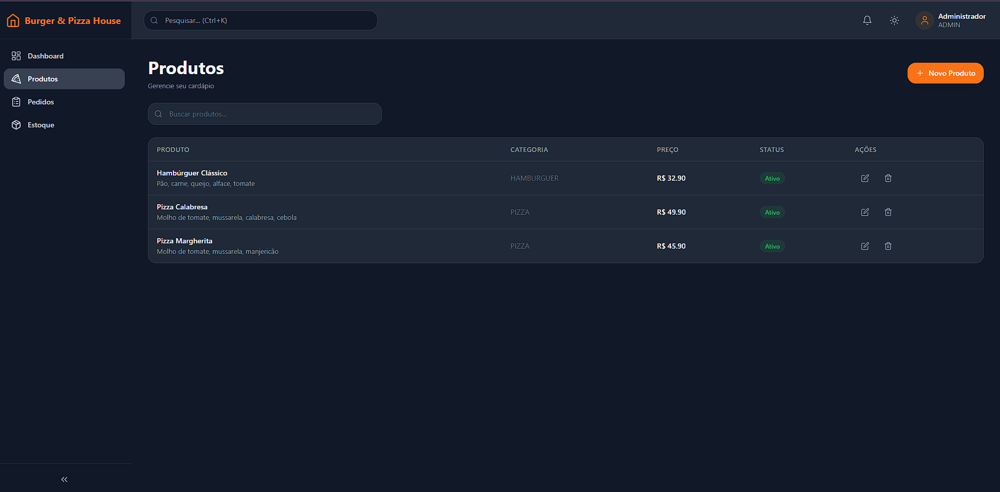
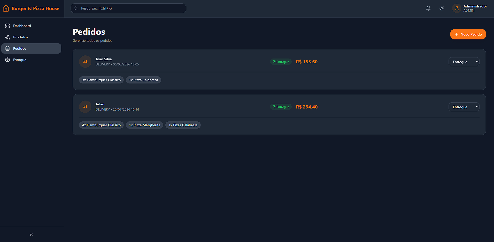

🍕 Burger & Pizza House ERP

Sistema de gestão para pizzarias e hamburguerias

Aplicação web completa para gerenciamento de pedidos, produtos, estoque e indicadores operacionais, com autenticação segura e interface responsiva.

📌 Sobre o projeto

O Burger & Pizza House ERP é uma aplicação full stack desenvolvida para centralizar a operação de pizzarias e hamburguerias.

O sistema oferece uma experiência completa para gerenciamento de:

📊 Indicadores e desempenho operacional

📦 Produtos e categorias

🛒 Pedidos e status de atendimento

🥬 Ingredientes e controle de estoque

🔐 Autenticação e controle de acesso

🎨 Interface responsiva com tema claro e escuro

A aplicação é composta por uma API REST em Node.js e um frontend em Angular 20, com foco em organização, segurança, validação de dados e regras de negócio.

📸 Preview

Dashboard

Produtos

Pedidos

Estoque

🧭 Índice

Funcionalidades

Stack tecnológica

Estrutura

Arquitetura

Instalação e execução

Variáveis de ambiente

Credenciais

Atalhos de teclado

Design system

Segurança

Testes e qualidade

API REST

Scripts

Roadmap

Licença

Autor

✨ Funcionalidades

📊 Dashboard - receita do dia, receita total, ticket médio, total de pedidos, produtos mais vendidos, gráfico de faturamento por período, pedidos recentes e alerta de estoque crítico.

📦 Produtos - cadastro, edição, exclusão (soft delete), busca por nome, categorias e controle de preço/custo.

🛒 Pedidos - carrinho de itens, dados do cliente, desconto, taxa de entrega, forma de pagamento, alteração de status com transições validadas e histórico completo.

🥬 Estoque - cadastro de ingredientes, controle de quantidade, estoque mínimo configurável, alertas visuais e baixa automática ao confirmar pedidos.

🔐 Autenticação - login com JWT em cookie httpOnly, rotas protegidas (guards) e controle de sessão.

🎨 Interface - layout responsivo, sidebar recolhível, tema claro/escuro/automático, feedback visual (toasts) e atalhos de teclado.

🛠️ Stack tecnológica

Backend

Tecnologia

Uso

Node.js + Express

API REST

TypeScript

Linguagem

Prisma ORM

Acesso ao banco

SQLite

Banco de dados

JWT + Bcrypt

Autenticação e hash de senha

Zod

Validação de entrada

Jest + ts-jest

Testes automatizados

Frontend

Tecnologia

Uso

Angular 20

Framework (standalone components, signals)

Tailwind CSS v4

Estilização (sintaxe @theme)

@lucide/angular

Ícones

date-fns

Formatação de datas (locale pt-BR)

RxJS + HttpClient

Comunicação com a API

📂 Estrutura

Burger-Pizza-House-Angular
│
├── backend
│   ├── prisma                   # schema.prisma, migrations, seed
│   ├── src
│   │   ├── controllers
│   │   ├── middlewares
│   │   ├── routes
│   │   ├── schemas              # validação Zod
│   │   └── server.ts
│   └── package.json
│
└── frontend-angular
    ├── src
    │   ├── app
    │   │   ├── core              # models, services, guards, interceptors
    │   │   ├── shared            # componentes reutilizáveis (badge, empty state, toast, gráfico...)
    │   │   ├── layout            # shell com sidebar + topbar
    │   │   ├── pages             # login, dashboard, products, orders, ingredients, not-found
    │   │   ├── app.config.ts
    │   │   └── app.routes.ts
    │   ├── environments          # apiUrl (dev/prod)
    │   └── styles.css            # design tokens do Tailwind v4 (@theme)
    ├── proxy.conf.json           # redireciona /api -> localhost:5000 em dev
    └── package.json

🏗️ Arquitetura

┌──────────────────────────────┐
│        Angular 20            │
│  UI · Guards · Services      │
│  RxJS · HttpClient           │
└──────────────┬───────────────┘
               │ HTTP / REST
               ▼
┌──────────────────────────────┐
│      Node.js + Express       │
│ Controllers · Routes         │
│ Middlewares · Validation     │
└──────────────┬───────────────┘
               │ Prisma ORM
               ▼
┌──────────────────────────────┐
│            SQLite            │
│       Dados da aplicação     │
└──────────────────────────────┘

Principais responsabilidades

Frontend: interface, navegação, guards, serviços e comunicação com a API.

Backend: autenticação, validação, regras de negócio e operações transacionais.

Banco de dados: persistência dos usuários, produtos, pedidos e ingredientes.

🚀 Instalação e execução

Pré-requisitos

Node.js 20+ (recomendado 22)

npm

1. Backend

cd backend
npm install

cp .env.example .env

npx prisma generate
npx prisma migrate dev
npm run seed

npm run dev

A API estará disponível em http://localhost:5000 (todas as rotas ficam sob o prefixo /api, ex.: http://localhost:5000/api/products).

Windows + erro Cannot read properties of undefined (reading 'fileExists') no ts-node? Isso acontece quando existe um ts-node instalado globalmente com versão incompatível. Este projeto já contorna isso via nodemon.json. Se ainda ocorrer, rode npm uninstall -g ts-node.

Ambientes com rede restrita (proxies corporativos, sandboxes de CI): o prisma generate/migrate baixa os binários da engine na primeira execução. Se o domínio estiver bloqueado, os comandos acima falham com 403 Forbidden - isso não é um problema no código. Libere o acesso ou rode esses dois comandos em uma máquina com acesso normal à internet antes de subir o servidor.

2. Frontend Angular

Em outro terminal, com o backend já rodando:

cd frontend-angular
npm install
npm start

A aplicação estará disponível em http://localhost:4200. O npm start já sobe com --proxy-config proxy.conf.json, que redireciona as chamadas /api/* para http://localhost:5000 - não precisa configurar CORS extra em desenvolvimento.

Build de produção:

npm run build

Gera os arquivos estáticos em dist/frontend-angular/browser. Antes de publicar, ajuste src/environments/environment.prod.ts com a URL real da sua API (o build de produção usa esse arquivo automaticamente via fileReplacements no angular.json).

⚙️ Variáveis de ambiente

Backend (backend/.env):

DATABASE_URL="file:./dev.db"

JWT_SECRET=your_secret_key

PORT=5000

# Origens permitidas para CORS, separadas por vírgula
CORS_ORIGIN=http://localhost:4200

O .env.example do backend não traz CORS_ORIGIN por padrão - adicione a variável acima (com a porta 4200, padrão do Angular) se for acessar a API diretamente sem passar pelo proxy do Angular CLI (por exemplo, ao rodar ng build + servir os estáticos separadamente).

Frontend Angular (frontend-angular/src/environments/environment.ts e environment.prod.ts):

export const environment = {
  production: false,
  apiUrl: '/api', // em dev, o proxy.conf.json redireciona para o backend
};

🔑 Credenciais

Campo

Valor

Email

admin@burgerpizzahouse.com

Senha

admin123

Credenciais de um ambiente de demonstração/desenvolvimento, criadas pelo npm run seed. Não reutilize essa senha em um deploy público.

⌨️ Atalhos de teclado

Atalho

Ação

Ctrl/Cmd + K

Foca no campo de busca do topbar

Ctrl/Cmd + N

Vai para Produtos

Ctrl/Cmd + P

Vai para Pedidos

🎨 Design system

Cor primária: laranja #F97316 (hover #EA580C)

Cores de status: sucesso (#22C55E), erro (#EF4444), aviso (#F59E0B), info (#3B82F6)

Tema escuro ativado por classe .dark na raiz do documento (persistido em localStorage)

Componentes: cards, badges de status, tabelas, modais, inputs e botões com os mesmos tokens visuais

Os tokens vivem em frontend-angular/src/styles.css, usando a sintaxe @theme do Tailwind v4.

🔒 Segurança

Medidas aplicadas na API (backend):

Criação de usuários restrita a administradores - POST /api/auth/register exige um token de um usuário ADMIN autenticado. O primeiro admin é criado pelo npm run seed.

Token JWT em cookie httpOnly, não em localStorage - reduz a superfície de roubo de sessão via XSS. POST /api/auth/logout limpa o cookie no servidor.

JWT_SECRET obrigatório e com checagem de força mínima - o servidor recusa subir se a variável não existir ou for muito curta/óbvia.

Validação de entrada com Zod em todas as rotas de escrita (auth, produtos, ingredientes e pedidos).

Rate limiting: /api/auth/login aceita no máximo 10 tentativas a cada 15 minutos por IP; as demais rotas têm limite geral de 300 requisições/15min.

Helmet aplicando cabeçalhos HTTP de segurança padrão.

CORS configurável via CORS_ORIGIN no .env, com credentials: true para permitir o cookie de sessão entre origens diferentes.

Criação de pedido em transação atômica (prisma.$transaction) - numeração sequencial, checagem de estoque e baixa de ingredientes acontecem juntas, sem condição de corrida nem pedido "pela metade".

Checagem de estoque antes de confirmar o pedido - se faltar ingrediente, o pedido inteiro é rejeitado (409) com a lista de itens em falta.

Transições de status validadas - PATCH /api/orders/:id/status só aceita mudanças que fazem sentido no fluxo operacional.

Exclusão segura de produtos e ingredientes - produtos com pedidos associados são desativados (soft delete); ingredientes referenciados por algum produto não podem ser excluídos.

Mensagens de erro reduzidas em produção - com NODE_ENV=production, erros 5xx inesperados retornam mensagem genérica ao cliente.

Regras de negócio no backend - o discount de um pedido nunca pode superar o subtotal; discount e deliveryFee são validados como não-negativos.

Rotas protegidas no frontend - páginas internas redirecionam para /login quando não há usuário autenticado, via guard de rota (authGuard), sem depender só do 401 da API.

Banco local fora do controle de versão - *.db/*.sqlite estão no .gitignore.

🧪 Testes e qualidade

cd backend
npm test

30 testes automatizados (Jest + ts-jest):

Schemas de validação: payloads válidos/inválidos de login, registro e criação de pedido.

OrderController: criação de pedido com estoque suficiente/insuficiente, produto inativo, desconto maior que o subtotal, transições de status válidas/inválidas - com Prisma mockado.

errorHandler: erros 5xx genéricos ocultados em produção, erros de negócio mantendo a mensagem original, detalhes do Prisma não vazando.

cd frontend-angular
npm test

Testes unitários com Karma + Jasmine (requer Chrome/Chromium instalado).

📡 API REST

Todas as rotas abaixo estão sob o prefixo /api.

Autenticação

POST /api/auth/login
POST /api/auth/logout
GET  /api/auth/me
POST /api/auth/register   (requer token de ADMIN)

Produtos

GET    /api/products
POST   /api/products
PUT    /api/products/:id
DELETE /api/products/:id

Pedidos

GET   /api/orders
POST  /api/orders
PATCH /api/orders/:id/status

Estoque (ingredientes)

GET  /api/ingredients
POST /api/ingredients
PUT  /api/ingredients/:id

Dashboard

GET /api/dashboard/stats
GET /api/dashboard/revenue?days=7

📜 Scripts

Backend

npm run dev        # servidor com hot-reload
npm run build      # compila TypeScript
npm start          # roda o build compilado
npm run seed       # popula o banco com dados de demonstração
npm test           # roda os testes (Jest)
npx prisma studio  # abre o painel visual do banco

Frontend Angular

npm start        # ng serve com proxy para o backend (localhost:4200)
npm run build    # build de produção em dist/frontend-angular
npm run watch    # build em modo desenvolvimento com watch
npm test         # ng test (Karma + Jasmine - requer Chrome/Chromium instalado)

🗺️ Roadmap

Relatórios em PDF

Exportação Excel

Integração com impressora térmica

Multiempresa e RBAC

Integração iFood / WhatsApp

Gateway Pix / Cartão

PWA

Backup automático

Programa de fidelidade

📄 Licença

Distribuído sob a licença MIT.

🍕 Burger & Pizza House ERP - Angular

Sistema moderno para gestão de pizzarias e hamburguerias.

Backend em Node.js/Express/Prisma, frontend em Angular 20.

