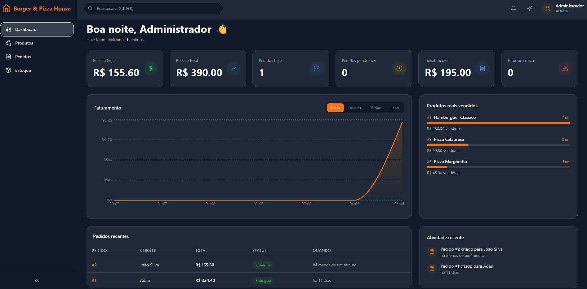
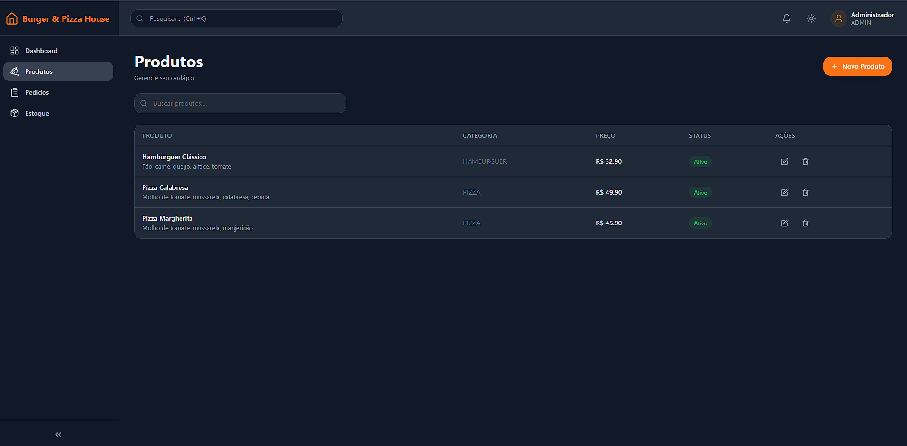
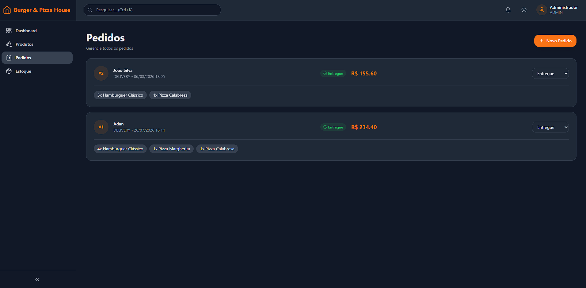
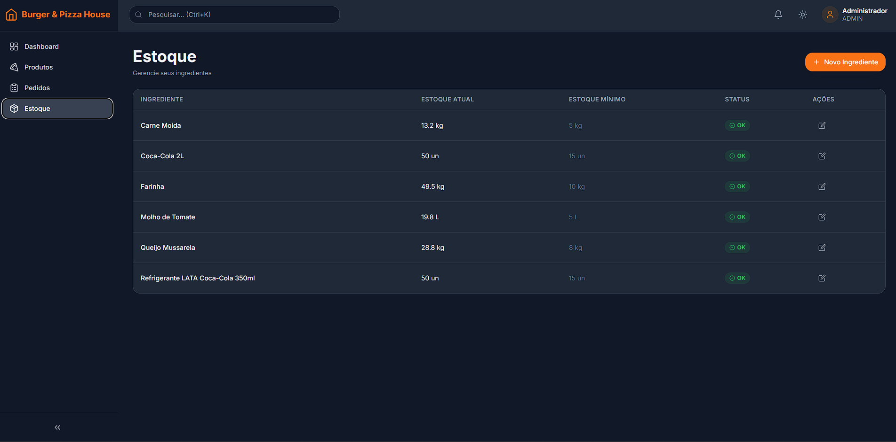

# 🍕 Burger & Pizza House ERP

Sistema ERP completo para pizzarias e hamburguerias desenvolvido com **React + Node.js + TypeScript**, oferecendo controle de pedidos, produtos, estoque, autenticação segura e dashboard com indicadores em tempo real.

---

## 📷 Preview


<div align="center">

| Dashboard | Produtos |
|-----------|-----------|
|  |  |

| Pedidos | Estoque |
|-----------|-----------|
|  |  |

</div>

---

# ✨ Funcionalidades

## 📊 Dashboard

- Receita diária
- Receita total
- Ticket médio
- Total de pedidos
- Produtos mais vendidos
- Gráfico de faturamento
- Pedidos recentes
- Estoque crítico

---

## 📦 Produtos

- Cadastro
- Edição
- Exclusão
- Busca
- Categorias
- Controle de preços

---

## 🛒 Pedidos

- Cadastro de clientes
- Produtos do pedido
- Desconto
- Taxa de entrega
- Formas de pagamento
- Alteração de status
- Histórico de pedidos

---

## 🥬 Estoque

- Cadastro de ingredientes
- Controle de quantidade
- Estoque mínimo
- Alertas visuais
- Atualização automática ao registrar pedidos

---

## 🔐 Autenticação

- Login JWT
- Senhas criptografadas com Bcrypt
- Rotas protegidas
- Controle de sessão

---

## 🎨 Interface

- Layout responsivo
- Sidebar recolhível
- Tema Claro
- Tema Escuro
- Tema Automático
- Feedback visual
- Design moderno

---

# 🛠️ Tecnologias

## Backend

| Tecnologia | Uso |
|------------|----------------|
| Node.js | Runtime |
| Express | API REST |
| TypeScript | Linguagem |
| Prisma ORM | ORM |
| SQLite | Banco de Dados |
| JWT | Autenticação |
| Bcrypt | Hash de senhas |

---

## Frontend

| Tecnologia | Uso |
|------------|----------------|
| React | Interface |
| Vite | Build |
| TypeScript | Linguagem |
| TailwindCSS | Estilização |
| Axios | API |
| React Router | Rotas |
| Recharts | Dashboard |

---

# 📂 Estrutura

```text
Burger-Pizza-House
│
├── backend
│   ├── prisma
│   ├── src
│   │   ├── controllers
│   │   ├── middlewares
│   │   ├── routes
│   │   ├── utils
│   │   └── server.ts
│   └── package.json
│
└── frontend
    ├── src
    │   ├── components
    │   ├── contexts
    │   ├── hooks
    │   ├── layouts
    │   ├── pages
    │   ├── services
    │   └── main.tsx
    └── package.json
```

---

# 🚀 Instalação

## Clone

```bash
git clone https://github.com/SEU-USUARIO/Burger-Pizza-House.git
```

---

## Backend

```bash
cd backend

npm install

cp .env.example .env

npx prisma generate

npx prisma migrate dev

npm run seed

npm run dev
```

Servidor:

```
http://localhost:5000
```

---

## Frontend

```bash
cd frontend

npm install

npm run dev
```

Aplicação:

```
http://localhost:5173
```

---

# ⚙️ Variáveis de Ambiente

Backend (`.env`)

```env
DATABASE_URL="file:./dev.db"

JWT_SECRET=your_secret_key

PORT=5000
```

---

# 🔑 Credenciais

| Campo | Valor |
|-------|-------|
| Email | admin@burgerpizzahouse.com |
| Senha | admin123 |

---

# 📈 Indicadores do Dashboard

- Receita diária
- Receita total
- Ticket médio
- Pedidos do dia
- Produtos mais vendidos
- Estoque crítico
- Evolução do faturamento
- Pedidos recentes

---

# ⌨️ Atalhos

| Atalho | Ação |
|---------|------|
| Ctrl + 1 | Dashboard |
| Ctrl + 2 | Produtos |
| Ctrl + 3 | Pedidos |
| Ctrl + 4 | Estoque |
| Ctrl + L | Logout |

---

# 📜 Scripts

## Backend

```bash
npm run dev
npm run build
npm start
npm run seed
```

Prisma

```bash
npx prisma studio
```

---

## Frontend

```bash
npm run dev
npm run build
npm run preview
npm run lint
```

---

# 🚧 Roadmap

### Próximas funcionalidades

- [ ] Relatórios em PDF
- [ ] Exportação Excel
- [ ] Impressora térmica
- [ ] Multiempresa
- [ ] RBAC
- [ ] Integração iFood
- [ ] WhatsApp
- [ ] Gateway PIX
- [ ] Gateway Cartão
- [ ] PWA
- [ ] React Native
- [ ] Backup automático
- [ ] Inteligência de vendas
- [ ] Programa de fidelidade

---

# 🧪 Testes

Em desenvolvimento.

---

# 📌 API

## Principais Endpoints

### Autenticação

```
POST /auth/login
POST /auth/register
```

### Produtos

```
GET /products
POST /products
PUT /products/:id
DELETE /products/:id
```

### Pedidos

```
GET /orders
POST /orders
PATCH /orders/:id
```

### Estoque

```
GET /stock
POST /stock
PUT /stock/:id
```

---

# 🤝 Contribuindo

1. Faça um Fork

2. Crie uma branch

```bash
git checkout -b feature/minha-feature
```

3. Commit

```bash
git commit -m "Minha feature"
```

4. Push

```bash
git push origin feature/minha-feature
```

5. Abra um Pull Request

---

# 📄 Licença

Distribuído sob a licença MIT.

---

# 👨‍💻 Autor

**Adan William Oliveira Santos**

GitHub

https://github.com/adanwilliamdev

LinkedIn

https://www.linkedin.com/in/adanwilliam

Portfólio

https://adanwilliamdev.github.io/

---

<div align="center">

### 🍕 Burger & Pizza House ERP

Sistema moderno para gestão de pizzarias e hamburguerias.

Desenvolvido com ❤️ utilizando React, Node.js e TypeScript.

</div>